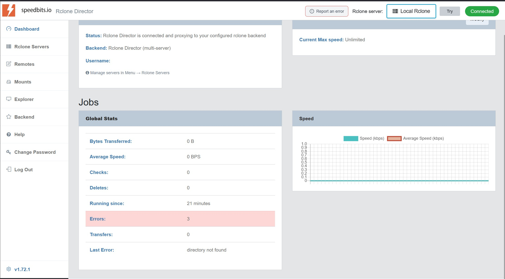
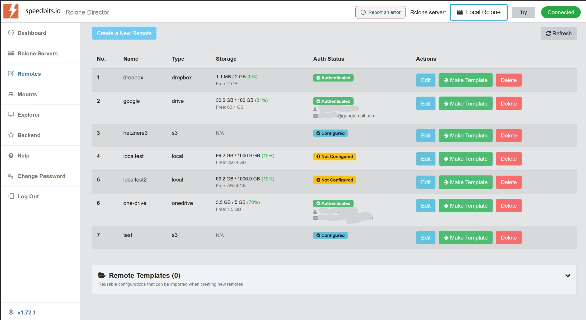
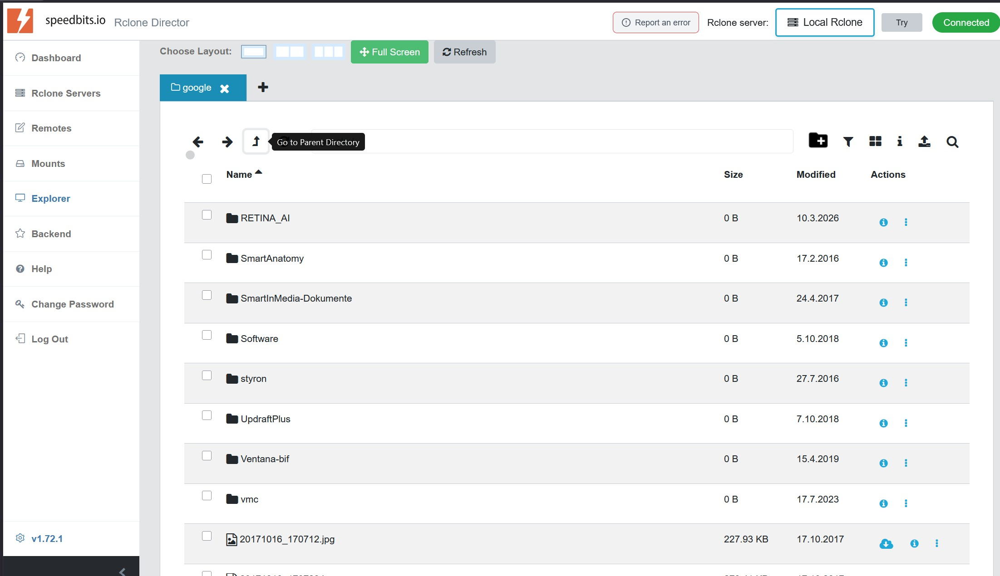
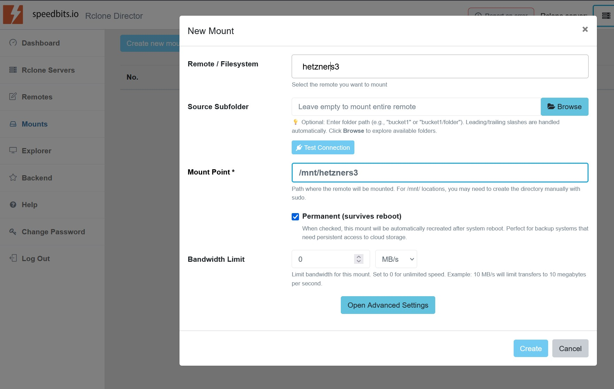

# Rclone Director UI

**A modern, powerful web interface for Rclone - manage cloud storage remotes and mounts with ease**

Configure, browse, and manage your cloud storage connections through an intuitive UI. Supports 70+ cloud providers including AWS S3, Google Drive, Dropbox, OneDrive, and many more - all fully Dockerized.

---

## Screenshots

### Dashboard
Overview of your Rclone backend status, version info, and quick access to all features.



### Remote Management
Create and manage cloud storage connections with a step-by-step wizard. Configure credentials, endpoints, and options through an intuitive interface.



### File Explorer
Browse your cloud storage with a visual file explorer. Navigate folders, download files, and manage your data across all connected remotes.



### Mount Management
Mount cloud storage as local drives on your server. Create persistent mounts that survive reboots.



---

## Why Rclone Director UI?

Rclone is a powerful command-line tool for syncing files to and from cloud storage, but managing configurations and remotes requires editing config files and remembering CLI commands.

**Rclone Director UI** brings Rclone to everyone with:

- A visual wizard for creating cloud storage remotes - no config file editing required
- Support for 70+ cloud providers (S3, Google Drive, Dropbox, OneDrive, etc.)
- Built-in file browser for exploring your cloud storage
- Mount management for accessing cloud storage as local drives
- Real-time connection testing and status monitoring

---

## Features

### Multi-Provider Support
Connect to virtually any cloud storage:
- **S3-Compatible**: AWS, Hetzner, DigitalOcean, Wasabi, MinIO, Backblaze B2
- **Google**: Drive, Cloud Storage, Photos
- **Microsoft**: OneDrive, SharePoint, Azure Blob
- **Others**: Dropbox, Box, pCloud, SFTP, WebDAV, and 60+ more

### Additional Features
- **OAuth Support**: Easy authentication for Google, Dropbox, OneDrive, etc.
- **Connection Testing**: Verify your credentials before saving
- **Secure Storage**: Passwords encrypted at rest
- **RESTful API**: Integrate with your automation workflows

---

## Deployment and Local Run

### 1) Infinity Tools (Preferred)

Recommended for production and easiest setup.

1. Go to **[speedbits.io/infinity-tools](https://speedbits.io/infinity-tools/)**
2. Download and install Infinity Tools (Community is available)
3. In Infinity Tools, open **Infinity Apps** and install **Rclone Director UI**

Infinity Tools handles container setup and updates for you.

### 2) Docker (Pre-built Community Image)

Use this if you want a direct Docker deployment without Infinity Tools.

```yaml
services:
  rclone-director-ui:
    image: ghcr.io/speedbitsinfinitytools/rclone-director-ui:latest
    container_name: rclone-director-ui
    ports:
      - "8080:80"
    volumes:
      - ./config:/config
      - ./logs:/logs
    environment:
      - ADMIN_PASSWORD=changeme
    restart: unless-stopped
```

```bash
docker compose up -d
```

Open `http://localhost:8080`.

### 3) Run Locally with npm (No Docker)

You must run three processes in separate terminals:

```
┌─────────────────┐     ┌──────────────────┐     ┌─────────────────┐
│   Browser UI    │────▶│  Director API    │────▶│   Rclone RCD    │
│  localhost:3000 │     │  localhost:5573  │     │  localhost:5572 │
│   (Frontend)    │     │    (Backend)     │     │  (Cloud Engine) │
└─────────────────┘     └──────────────────┘     └─────────────────┘
     Terminal 3              Terminal 2              Terminal 1
```

| Process | What it does |
|---------|--------------|
| **Rclone RCD** | The rclone remote control daemon - actually connects to cloud storage (S3, Google Drive, etc.) |
| **Director** | Backend API server - handles authentication, config storage, proxies requests to RCD |
| **Frontend** | React web application - the UI you interact with in your browser |

#### Step 1: Install rclone

- Linux: `curl https://rclone.org/install.sh | sudo bash`
- macOS: `brew install rclone`
- Windows: `winget install rclone.rclone`

#### Step 2: Start rclone RCD (Terminal 1)

```bash
rclone rcd \
  --rc-addr 127.0.0.1:5572 \
  --rc-user admin \
  --rc-pass admin \
  --rc-serve \
  --log-level INFO
```

**Important flags:**
- `--rc-serve` - **Required for file downloads** - enables HTTP file serving
- `--rc-user` / `--rc-pass` - Authentication credentials (must match `.env` settings)
- `--rc-addr` - Address and port to listen on

#### Step 3: Configure and start the backend (Terminal 2)

```bash
cd rclone-director
cp .env.example .env    # Copy config template
npm install
npm start
```

The `.env` file contains all configuration options with sensible defaults for local development. Edit it if you need to change ports, credentials, or paths.

#### Step 4: Start the frontend (Terminal 3)

```bash
cd ..                   # Back to root directory
npm install
npm start
```

#### Step 5: Open the UI

Open `http://localhost:3000` and login with username `admin` and password `admin`.

#### Default Configuration

| Service | Address | Credentials |
|---------|---------|-------------|
| Rclone RCD | `127.0.0.1:5572` | `admin` / `admin` |
| Director Backend | `127.0.0.1:5573` | - |
| Frontend | `127.0.0.1:3000` | - |
| UI Login | - | `admin` / `admin` |

#### Configuration Reference

All settings are in `rclone-director/.env`:

| Variable | Description | Default |
|----------|-------------|---------|
| `ADMIN_PASSWORD` | UI login password (first run only) | `admin` |
| `DATA_DIR` | Config storage directory | `./data` |
| `RCLONE_DEFAULT_HOST` | RCD hostname | `localhost` |
| `RCLONE_RCD_PORT` | RCD port | `5572` |
| `RCLONE_DEFAULT_USER` | RCD username | `admin` |
| `RCLONE_DEFAULT_PASS` | RCD password | `admin` |

**Important**: RCD credentials in `.env` must match those used when starting `rclone rcd`.

### Login and Default Password

- Username is always `admin`.
- Password comes from `ADMIN_PASSWORD` on first backend start.
- If `ADMIN_PASSWORD` is not set, default is `admin`.
- After first start, the hashed password is stored in `admin.json` under your `DATA_DIR` and reused on next starts.

For security, set a strong `ADMIN_PASSWORD` before first startup in each new environment.

---

## Editions

### Community Edition (This Repository)

**Free for personal and private use.**

Includes all core features:
- Single Rclone server management
- Full remote creation and management
- All 70+ cloud providers
- File browser
- Mount management
- OAuth authentication

### Commercial Edition

For commercial use or to unlock **Multi-Server Mode**, visit **[www.speedbits.io](https://www.speedbits.io)**.

**Multi-Server Mode** provides centralized management for multiple Rclone instances:

| Feature | Community | Commercial |
|---------|:---------:|:----------:|
| Single Server Mode | Yes | Yes |
| All Cloud Providers | Yes | Yes |
| Remote Management | Yes | Yes |
| Mount Management | Yes | Yes |
| **Multi-Server Mode** | No | Yes |
| Add Multiple Servers | No | Yes |
| Centralized Management | No | Yes |

**Multi-Server Mode advantages:**
- **Centralized management** - Manage Rclone on multiple servers from one UI
- **Add unlimited servers** - Connect to any number of Rclone RCD instances
- **Server switching** - Quickly switch between different Rclone servers

---

## Licensing

This software is provided under a **dual license**:

- **Community License** - Free for personal, private, non-commercial use
- **Commercial License** - Required for business/commercial use

**Personal and private use is free forever.**

For commercial licensing, please visit **[www.speedbits.io](https://www.speedbits.io)**.

---

## Requirements

- Docker and Docker Compose
- Linux host (recommended) or Windows/macOS with Docker Desktop
- 256MB RAM minimum, 512MB recommended

---

## Support

- **Issues**: Use GitHub Issues for bug reports
- **Commercial Support**: [support@speedbits.io](mailto:support@speedbits.io)
- **Website**: [https://speedbits.io](https://speedbits.io)

---

## Infinity Tools

Using **Infinity Tools**? Rclone Director UI is included! Install it directly from the Infinity Tools menu under Apps.

[Get Infinity Tools](https://license.speedbits.io/register/infinitycommunity)

---

**Copyright 2025 Smart In Venture GmbH, Germany. All Rights Reserved.**

*Built with care by the Speedbits team.*
